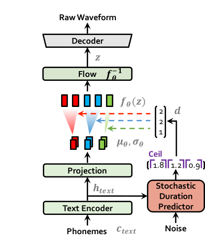

# VITS: Conditional Variational Autoencoder with Adversarial Learning for End-to-End Text-to-Speech<br>
### This is the exerpt from original paper by the following authors.

### Jaehyeon Kim, Jungil Kong, and Juhee Son

In our recent [paper](https://arxiv.org/abs/2106.06103), we propose VITS: Conditional Variational Autoencoder with Adversarial Learning for End-to-End Text-to-Speech.

Several recent end-to-end text-to-speech (TTS) models enabling single-stage training and parallel sampling have been proposed, but their sample quality does not match that of two-stage TTS systems. In this work, we present a parallel end-to-end TTS method that generates more natural sounding audio than current two-stage models. Our method adopts variational inference augmented with normalizing flows and an adversarial training process, which improves the expressive power of generative modeling. We also propose a stochastic duration predictor to synthesize speech with diverse rhythms from input text. With the uncertainty modeling over latent variables and the stochastic duration predictor, our method expresses the natural one-to-many relationship in which a text input can be spoken in multiple ways with different pitches and rhythms. A subjective human evaluation (mean opinion score, or MOS) on the LJ Speech, a single speaker dataset, shows that our method outperforms the best publicly available TTS systems and achieves a MOS comparable to ground truth.<br>

<table style="width:100%">
  <tr>
    <th>VITS at training</th>
    <th>VITS at inference</th>
  </tr>
  <tr>
    <td></td>
    <td></td>
  </tr>
</table>

## Installation:

<a name="installation"></a>

**Clone the repo**

```shell
git clone git@github.com:SameerSri72/Sanskrit-text-to-speech.git
```
## Setting up the conda env

This is assuming you have navigated to the root folder after cloning it.

**NOTE:** This is tested under `python3.11` with conda env. For other python versions, you might encounter version conflicts.
**NOTE:** This is tested under `python3.11` with conda env. For other python versions, you might encounter version conflicts.

**PyTorch 2.0**
Please refer [requirements.txt](requirements.txt)
Please refer [requirements.txt](requirements.txt)

```shell
# install required packages (for pytorch 2.0)
conda create -n vits python=3.11
conda activate vits
pip install -r requirements.txt
```

## Download datasets

There are three options you can choose from: LJ Speech, VCTK, and custom dataset.

1. LJ Speech: [LJ Speech dataset](#lj-speech-dataset). Used for single speaker TTS.
2. VCTK: [VCTK dataset](#vctk-dataset). Used for multi-speaker TTS.
3. Custom dataset: You can use your own dataset. (I have used Saskrit text and audio files here, data is locally available with me can not upload it publicly due to copyright)

### Custom dataset

1. create a folder with wav files
2. create configuration file in [configs](configs/). Change the following fields in `custom_base.json`:
3. create configuration file in [configs](configs/). Change the following fields in `custom_base.json`:

```js
{
  "data": {
    "training_files": "filelists/custom_audio_text_train_filelist.txt.cleaned", // path to training cleaned filelist
    "validation_files": "filelists/custom_audio_text_val_filelist.txt.cleaned", // path to validation cleaned filelist
    "text_cleaners": ["sanskrit_cleaners"], // text cleaner
    "bits_per_sample": 16, // bit depth of wav files
    "training_files": "filelists/custom_audio_text_train_filelist.txt.cleaned", // path to training cleaned filelist
    "validation_files": "filelists/custom_audio_text_val_filelist.txt.cleaned", // path to validation cleaned filelist
    "text_cleaners": ["english_cleaners2"], // text cleaner
    "bits_per_sample": 16, // bit depth of wav files
    "sampling_rate": 22050, // sampling rate if you resampled your wav files
    ...
    "n_speakers": 0, // number of speakers in your dataset if you use multi-speaker setting
    "cleaned_text": true // if you already cleaned your text (See text_phonemizer.ipynb), set this to true
  },
  ...
    "cleaned_text": true // if you already cleaned your text (See text_phonemizer.ipynb), set this to true
  },
  ...
}
```

3. install espeak-ng (optional)

**NOTE:** This is required for the [preprocess.py](preprocess.py) and [inference.ipynb](inference.ipynb) notebook to work. If you don't need it, you can skip this step. Please refer [espeak-ng](https://github.com/espeak-ng/espeak-ng)

4. preprocess text

You can do this step by step way: (No phonemization needed for Sanskrit)

- create a dataset of text files. See [text_dataset.ipynb](preprocess/text_dataset.ipynb)
- phonemize or just clean up the text. Please refer [text_phonemizer.ipynb](preprocess/text_phonemizer.ipynb)
- create filelists and cleaned version with train test split. See [text_split.ipynb](preprocess/text_split.ipynb)
- rename or create a link to the dataset folder. Please refer [text_split.ipynb](preprocess/text_split.ipynb)

```shell
ln -s /path/to/custom_dataset DUMMY3
```

## Training Examples

```shell
# LJ Speech
python train.py -c configs/ljs_base.json -m ljs_base

# VCTK
python train_ms.py -c configs/vctk_base.json -m vctk_base

#Sanskrit
python train.py -c configs/sans_base.json -m sans_base

# Custom dataset (multi-speaker)
python train_ms.py -c configs/custom_base.json -m custom_base
```

## Inference Example
After training refer to infer.ipynb<br>
# Generated Sample Audio from Sanskrit Text:<br>
### Sanskrit Text: हे भगवन् त्वम् आत्मानम् लोकानुग्रहार्थम् ब्रह्मरूपेण उत्पिपादयिषितम् स्वस्वरूपम् आत्मनैव वेत्सि जानासि ।<br>
### Audio File: [Click here to listen to the audio](https://github.com/SameerSri72/Sanskrit-text-to-speech/blob/master/audio_1.wav)<br>
### Sanskrit Text: निरन्तरासु नीरन्ध्रासु अन्तरे मध्ये वातो यासाम् तादृश्यः या वृष्टयः तासु अन्तरवातवृष्टिषु<br>
### Audio File: [Click here to listen to the audio](https://github.com/SameerSri72/Sanskrit-text-to-speech/blob/master/audio_2.wav)


  
## Acknowledgements

- This repo is based on [VITS](https://github.com/jaywalnut310/vits)
- Also thanks to Daniil Robnikov for his work [link](https://github.com/daniilrobnikov/vits)
  

## References

- [VITS: Conditional Variational Autoencoder with Adversarial Learning for End-to-End Text-to-Speech](https://arxiv.org/abs/2106.06103)
- [A TensorFlow implementation of Google's Tacotron speech synthesis with pre-trained model (unofficial)](https://github.com/keithito/tacotron)

# vits
